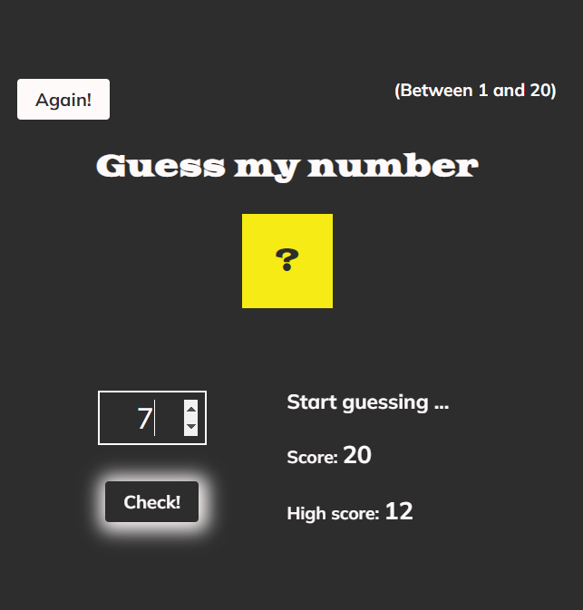
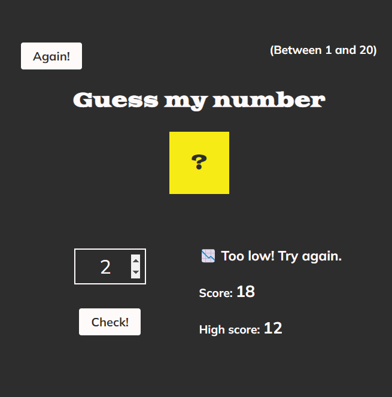
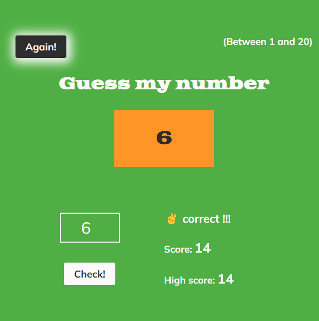

# Guess Secret Number

Vanilla Javascript project, to practice the DOM Manipulation.

## Introduction

Game to guess randomly generated number between 1 - 20. Game shows hints and stores high score.

## Technologies used

- JavaScript
- HTML
- CSS

## Visuals

 

## Usage

- insert your guess
- press 'Enter' or click 'Check'
- follow hints
- click 'Again' to play again
- 🥳 have fun!

## Further development ideas

- do same with TypeScript

  ## Note

  - Project was built elsewhere and moved to this repository later
